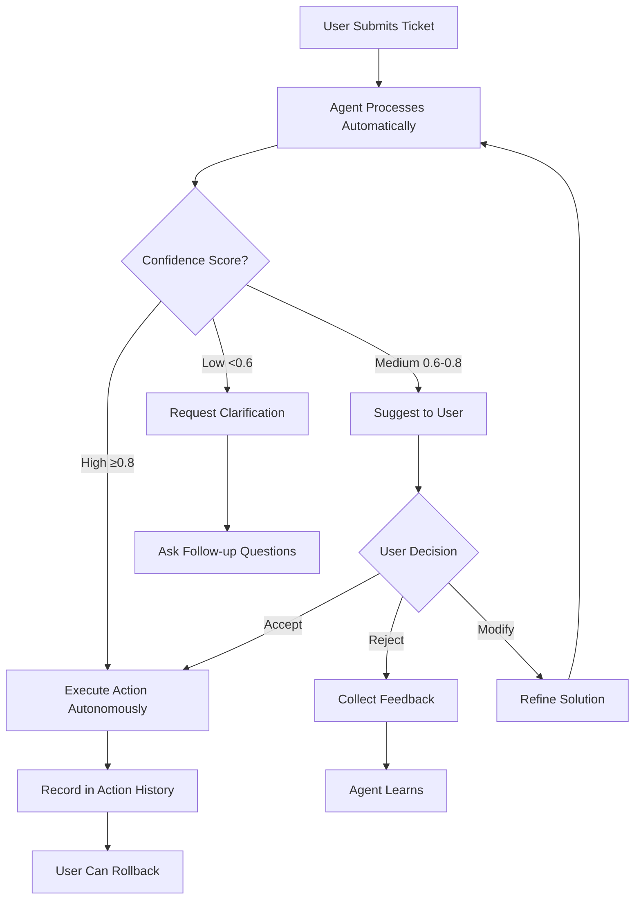

# AI Agent Interactive API Documentation

Welcome to the ResolveMeQ AI Agent API! This guide shows you how to build interactive, intelligent experiences with our autonomous AI helpdesk agent.

## 🎯 What Makes This Special

Our AI Agent doesn't just suggest solutions - it **acts autonomously**, **learns from interactions**, and provides **confidence-scored recommendations** that your users can accept, reject, or refine.

---

## Table of Contents

- [Quick Start](#quick-start)
- [Core Concepts](#core-concepts)
- [Authentication](#authentication)
- [Agent Workflow](#agent-workflow)
- [API Endpoints](#api-endpoints)
  - [1. Trigger Agent Processing](#1-trigger-agent-processing)
  - [2. Get AI Recommendations](#2-get-ai-recommendations)
  - [3. Check Agent Status](#3-check-agent-status)
  - [4. Get AI Suggestions for Ticket](#4-get-ai-suggestions-for-ticket)
  - [5. Action History & Audit Trail](#5-action-history--audit-trail)
  - [6. Rollback Actions](#6-rollback-actions)
  - [7. Agent Analytics](#7-agent-analytics)
  - [8. Knowledge Base Search](#8-knowledge-base-search)
  - [9. Resolution Feedback](#9-resolution-feedback)
  - [10. Task Status Monitoring](#10-task-status-monitoring)
  - [11. AI Chat Conversation](#11-ai-chat-conversation)
  - [12. Resolution Templates](#12-resolution-templates)
  - [13. AI Confidence Explanation](#13-ai-confidence-explanation)
  - [14. Similar Tickets](#14-similar-tickets)
- [Interactive UI Patterns](#interactive-ui-patterns)
- [WebSocket Real-Time Updates](#websocket-real-time-updates)
- [Error Handling](#error-handling)
- [Best Practices](#best-practices)

---

## Quick Start

### Basic Flow

```javascript
// 1. User submits a ticket
const ticket = await createTicket({
  issue_type: "Email not working",
  description: "Outlook won't send emails",
  category: "email"
});

// 2. Agent automatically processes it (or trigger manually)
const processing = await triggerAgentProcessing(ticket.ticket_id);

// 3. Poll for recommendations
const recommendations = await getAgentRecommendations();

// 4. Show user the AI suggestion with confidence score
if (recommendations.length > 0) {
  const suggestion = recommendations[0];
  showSuggestionCard({
    title: "AI Agent found a solution",
    confidence: suggestion.confidence, // 0.85
    action: suggestion.recommended_action, // "auto_resolve"
    steps: suggestion.solution.steps
  });
}

// 5. User can accept, reject, or request changes
userAccepts() → executeAction();
userRejects() → submitFeedback();
```

---

## Core Concepts

### Agent Actions

The AI can autonomously take these actions:

| Action | When It Happens | Confidence Required |
|--------|----------------|---------------------|
| **AUTO_RESOLVE** | Agent has high-confidence solution | ≥ 0.8 |
| **ESCALATE** | Critical issue or low confidence | Any (critical issues) |
| **REQUEST_CLARIFICATION** | Needs more info | 0.3 - 0.6 |
| **ASSIGN_TO_TEAM** | Knows the right team | ≥ 0.8 |
| **SCHEDULE_FOLLOWUP** | Medium confidence solution | 0.6 - 0.8 |
| **CREATE_KB_ARTICLE** | New pattern detected | ≥ 0.8 |

### Confidence Scores

- **High (≥ 0.8)**: Agent can act autonomously
- **Medium (0.6 - 0.8)**: Agent suggests, waits for approval
- **Low (< 0.6)**: Agent requests clarification

### Agent Response Format

When the agent processes a ticket, you get:

```json
{
  "confidence": 0.85,
  "recommended_action": "auto_resolve",
  "analysis": {
    "category": "email_issue",
    "severity": "medium",
    "complexity": "low",
    "suggested_team": "IT Support"
  },
  "solution": {
    "steps": [
      "Check Outlook connection settings",
      "Verify SMTP configuration",
      "Test with a simple email"
    ],
    "estimated_time": "10 minutes",
    "success_probability": 0.9
  },
  "reasoning": "This is a common Outlook configuration issue with a known solution"
}
```

---

## Authentication

All agent endpoints require authentication:

```javascript
// Include JWT token in headers
const headers = {
  'Authorization': `Bearer ${userToken}`,
  'Content-Type': 'application/json'
};
```

**Exception:** Agent-to-backend communication uses `X-Agent-API-Key` header.

---

## Agent Workflow



---

## API Endpoints

### 1. Trigger Agent Processing

**Manually trigger AI analysis for a ticket.**

#### Endpoint
```
POST /api/tickets/{ticket_id}/process/
```

#### Use Case
- User clicks "Get AI Help" button
- Admin wants to re-analyze a ticket
- Ticket needs fresh analysis after new information

#### Request

No body required. Optional:

```json
{
  "reset": true  // Clear previous agent response and re-analyze
}
```

#### Response

```json
{
  "task_id": "abc-123-def-456",
  "ticket_id": 42,
  "status": "queued",
  "agent_processed": false
}
```

#### UI Pattern

```jsx
function AgentProcessButton({ ticketId }) {
  const [processing, setProcessing] = useState(false);
  const [taskId, setTaskId] = useState(null);

  const handleClick = async () => {
    setProcessing(true);
    const result = await fetch(
      `/api/tickets/${ticketId}/process/`,
      { method: 'POST', headers }
    );
    const data = await result.json();
    setTaskId(data.task_id);
    
    // Poll for completion
    pollTaskStatus(data.task_id);
  };

  return (
    <button 
      onClick={handleClick}
      disabled={processing}
      className="bg-blue-500 text-white px-4 py-2 rounded"
    >
      {processing ? (
        <>
          <Spinner /> Processing...
        </>
      ) : (
        <>
          <BrainIcon /> Get AI Help
        </>
      )}
    </button>
  );
}
```

---

### 2. Get AI Recommendations

**Get proactive recommendations for all pending tickets.**

#### Endpoint
```
GET /api/tickets/agent/recommendations/
```

#### Use Case
- Dashboard showing "Suggested Actions"
- Weekly digest of AI recommendations
- Proactive ticket management

#### Response

```json
{
  "recommendations": [
    {
      "ticket_id": 42,
      "issue_type": "Email issue",
      "description": "Outlook not syncing",
      "category": "email",
      "status": "open",
      "created_at": "2026-03-04T10:30:00Z",
      "recommendations": [
        {
          "type": "high_confidence_solution",
          "message": "High-confidence solution available - can auto-resolve",
          "action": "auto_resolve",
          "confidence": 0.85
        },
        {
          "type": "similar_tickets",
          "message": "Found 3 similar resolved ticket(s)",
          "action": "view_similar",
          "similar_count": 3
        }
      ]
    }
  ],
  "total_recommendations": 1,
  "generated_at": "2026-03-04T12:00:00Z"
}
```

#### UI Pattern

```jsx
function RecommendationsDashboard() {
  const [recommendations, setRecommendations] = useState([]);

  useEffect(() => {
    fetch('/api/tickets/agent/recommendations/', { headers })
      .then(r => r.json())
      .then(data => setRecommendations(data.recommendations));
  }, []);

  return (
    <div className="space-y-4">
      <h2>🤖 AI Recommendations</h2>
      {recommendations.map(rec => (
        <RecommendationCard key={rec.ticket_id} {...rec} />
      ))}
    </div>
  );
}

function RecommendationCard({ ticket_id, recommendations }) {
  return (
    <div className="border rounded-lg p-4 bg-blue-50">
      <div className="flex justify-between items-start">
        <div>
          <h3 className="font-bold">Ticket #{ticket_id}</h3>
          {recommendations.map((rec, i) => (
            <div key={i} className="mt-2">
              <ConfidenceBadge confidence={rec.confidence} />
              <p className="text-sm">{rec.message}</p>
              <button 
                onClick={() => handleAction(ticket_id, rec.action)}
                className="mt-2 text-blue-600 hover:underline"
              >
                {rec.action === 'auto_resolve' ? 'Resolve Now' : 'View Details'}
              </button>
            </div>
          ))}
        </div>
      </div>
    </div>
  );
}
```

---

### 3. Check Agent Status

**Get current agent processing status for a ticket.**

#### Endpoint
```
GET /api/tickets/{ticket_id}/agent-status/
```

#### Use Case
- Show "AI is thinking..." loading state
- Display what the agent found
- Check if analysis is complete

#### Response

```json
{
  "ticket_id": 42,
  "agent_processed": true,
  "agent_response": {
    "confidence": 0.85,
    "recommended_action": "auto_resolve",
    "analysis": {
      "category": "email_issue",
      "severity": "medium"
    },
    "solution": {
      "steps": ["Step 1", "Step 2"],
      "estimated_time": "10 minutes"
    }
  },
  "active_tasks": [],
  "last_updated": "2026-03-04T12:00:00Z"
}
```

#### UI Pattern

```jsx
function AgentStatusIndicator({ ticketId }) {
  const { data, loading } = useAgentStatus(ticketId);

  if (loading) {
    return <Spinner />;
  }

  if (!data.agent_processed) {
    return (
      <div className="flex items-center text-gray-500">
        <ClockIcon /> Waiting for AI analysis...
      </div>
    );
  }

  const { confidence, recommended_action } = data.agent_response;

  return (
    <div className="bg-green-50 p-4 rounded-lg">
      <div className="flex items-center justify-between">
        <div className="flex items-center">
          <CheckCircleIcon className="text-green-500" />
          <span className="ml-2 font-medium">AI Analysis Complete</span>
        </div>
        <ConfidenceBadge confidence={confidence} />
      </div>
      <AgentSuggestion 
        action={recommended_action}
        response={data.agent_response}
      />
    </div>
  );
}
```

---

### 4. Get AI Suggestions for Ticket

**Get AI-suggested solutions and similar tickets.**

#### Endpoint
```
GET /api/tickets/{ticket_id}/ai-suggestions/
```

#### Use Case
- Show "Similar Issues" sidebar
- Display alternative solutions
- Help users find existing answers

#### Response

```json
{
  "ticket_id": 42,
  "ai_suggestions": {
    "suggested_solution": "Check Outlook offline mode settings",
    "confidence": 0.85,
    "similar_tickets": [
      {
        "ticket_id": 38,
        "issue_type": "Email offline mode",
        "resolution": "Disabled offline mode in settings",
        "similarity_score": 0.92
      }
    ],
    "kb_articles": [
      {
        "id": "kb-123",
        "title": "How to Fix Outlook Offline Mode",
        "relevance": 0.88
      }
    ]
  },
  "generated_at": "2026-03-04T12:00:00Z"
}
```

#### UI Pattern

```jsx
function AISuggestionsSidebar({ ticketId }) {
  const { suggestions, loading } = useAISuggestions(ticketId);

  if (loading) return <SkeletonLoader />;

  return (
    <div className="space-y-6">
      {/* Suggested Solution */}
      <section>
        <h3 className="font-bold mb-2">💡 AI Suggested Solution</h3>
        <div className="bg-yellow-50 p-4 rounded">
          <p>{suggestions.suggested_solution}</p>
          <ConfidenceBadge confidence={suggestions.confidence} />
          <button className="mt-3 btn-primary">
            Try This Solution
          </button>
        </div>
      </section>

      {/* Similar Tickets */}
      <section>
        <h3 className="font-bold mb-2">🔍 Similar Issues</h3>
        {suggestions.similar_tickets.map(ticket => (
          <SimilarTicketCard key={ticket.ticket_id} {...ticket} />
        ))}
      </section>

      {/* KB Articles */}
      <section>
        <h3 className="font-bold mb-2">📚 Helpful Articles</h3>
        {suggestions.kb_articles.map(article => (
          <KBArticleCard key={article.id} {...article} />
        ))}
      </section>
    </div>
  );
}
```

---

### 5. Action History & Audit Trail

**See all autonomous actions the agent has taken on a ticket.**

#### Endpoint
```
GET /api/tickets/{ticket_id}/action-history/
```

#### Use Case
- Audit trail of AI decisions
- Understand what the agent did
- Enable rollback of actions

#### Response

```json
{
  "ticket_id": 42,
  "action_history": [
    {
      "id": "uuid-123",
      "action_type": "AUTO_RESOLVE",
      "executed_at": "2026-03-04T12:00:00Z",
      "executed_by": "autonomous_agent",
      "confidence_score": 0.85,
      "rollback_possible": true,
      "rolled_back": false,
      "rolled_back_at": null,
      "rollback_reason": null
    }
  ],
  "total_actions": 1
}
```

#### UI Pattern

```jsx
function ActionHistoryTimeline({ ticketId }) {
  const { actions } = useActionHistory(ticketId);

  return (
    <div className="space-y-4">
      <h3 className="font-bold">🕒 Action History</h3>
      {actions.map(action => (
        <div key={action.id} className="border-l-4 border-blue-500 pl-4">
          <div className="flex justify-between items-start">
            <div>
              <ActionIcon type={action.action_type} />
              <span className="font-medium">{action.action_type}</span>
              <p className="text-sm text-gray-500">
                {formatDistance(action.executed_at, new Date())} ago
              </p>
            </div>
            {action.rollback_possible && !action.rolled_back && (
              <button 
                onClick={() => rollbackAction(action.id)}
                className="text-red-600 hover:underline text-sm"
              >
                ↶ Undo
              </button>
            )}
            {action.rolled_back && (
              <span className="text-red-600 text-sm">
                ✓ Rolled back
              </span>
            )}
          </div>
        </div>
      ))}
    </div>
  );
}
```

---

### 6. Rollback Actions

**Undo an autonomous action taken by the agent.**

#### Endpoint
```
POST /api/tickets/actions/{action_history_id}/rollback/
```

#### Permissions
- Admin or Manager only
- Rate limited (5 rollbacks per hour)

#### Request

```json
{
  "reason": "User reported the issue persists"
}
```

#### Response

**Success (200)**
```json
{
  "message": "Action rolled back successfully",
  "action_id": "uuid-123",
  "ticket_id": 42,
  "rollback_details": {
    "original_status": "resolved",
    "new_status": "open",
    "restored_fields": ["status", "resolution"]
  }
}
```

**Error (400)**
```json
{
  "error": "This action was already rolled back"
}
```

#### UI Pattern

```jsx
function RollbackConfirmDialog({ action, onConfirm, onCancel }) {
  const [reason, setReason] = useState('');

  const handleRollback = async () => {
    const result = await fetch(
      `/api/tickets/actions/${action.id}/rollback/`,
      {
        method: 'POST',
        headers,
        body: JSON.stringify({ reason })
      }
    );

    if (result.ok) {
      toast.success('Action rolled back successfully');
      onConfirm();
    }
  };

  return (
    <Dialog>
      <h3>⚠️ Rollback Action</h3>
      <p>This will undo the {action.action_type} action.</p>
      
      <textarea
        placeholder="Reason for rollback..."
        value={reason}
        onChange={e => setReason(e.target.value)}
        className="w-full border rounded p-2 mt-3"
      />
      
      <div className="mt-4 flex gap-2">
        <button onClick={handleRollback} className="btn-danger">
          Rollback
        </button>
        <button onClick={onCancel} className="btn-secondary">
          Cancel
        </button>
      </div>
    </Dialog>
  );
}
```

---

### 7. Agent Analytics

**Get comprehensive performance metrics for the AI agent.**

#### Endpoint
```
GET /api/tickets/agent/analytics/
```

#### Use Case
- Admin dashboard showing agent performance
- Monthly reports
- ROI calculations

#### Response

```json
{
  "total_tickets": 1250,
  "processed_by_agent": 1100,
  "agent_processing_rate": 88.0,
  "resolution_success_rate": 76.5,
  "average_confidence_score": 0.812,
  "confidence_distribution": {
    "high": 850,
    "medium": 200,
    "low": 50
  },
  "knowledge_base": {
    "total_articles": 245,
    "recent_articles": 12
  },
  "autonomous_solutions": 680,
  "agent_status": "active",
  "last_updated": "2026-03-04T12:00:00Z"
}
```

#### UI Pattern

```jsx
function AgentAnalyticsDashboard() {
  const { analytics } = useAgentAnalytics();

  return (
    <div className="grid grid-cols-4 gap-4">
      <MetricCard
        title="Processing Rate"
        value={`${analytics.agent_processing_rate}%`}
        icon={<BrainIcon />}
        trend="+5.2%"
      />
      <MetricCard
        title="Resolution Success"
        value={`${analytics.resolution_success_rate}%`}
        icon={<CheckIcon />}
        trend="+3.1%"
      />
      <MetricCard
        title="Avg Confidence"
        value={analytics.average_confidence_score.toFixed(2)}
        icon={<StarIcon />}
      />
      <MetricCard
        title="Auto Solutions"
        value={analytics.autonomous_solutions}
        icon={<RobotIcon />}
      />

      {/* Confidence Distribution Chart */}
      <div className="col-span-2">
        <BarChart 
          data={analytics.confidence_distribution}
          title="Confidence Distribution"
        />
      </div>

      {/* Knowledge Base Growth */}
      <div className="col-span-2">
        <LineChart 
          data={analytics.kb_growth}
          title="Knowledge Base Growth"
        />
      </div>
    </div>
  );
}
```

---

### 8. Knowledge Base Search

**Enhanced KB search powered by AI.**

#### Endpoint
```
POST /api/tickets/agent/kb-search/
```

#### Request

```json
{
  "query": "email not syncing outlook",
  "max_results": 5,
  "min_relevance": 0.7
}
```

#### Response

```json
{
  "query": "email not syncing outlook",
  "results": [
    {
      "id": "kb-123",
      "title": "Fix Outlook Sync Issues",
      "content": "Step-by-step guide...",
      "relevance_score": 0.92,
      "tags": ["email", "outlook", "sync"]
    }
  ],
  "total_results": 1,
  "search_time_ms": 45
}
```

---

### 9. Resolution Feedback

**Submit feedback on agent's resolution.**

#### Endpoint
```
POST /api/tickets/{ticket_id}/resolution-feedback/
```

#### Request

```json
{
  "rating": 5,
  "was_helpful": true,
  "resolution_time_acceptable": true,
  "accuracy_rating": 5,
  "completeness_rating": 4,
  "clarity_rating": 5,
  "comments": "Great solution, worked perfectly!",
  "would_recommend": true
}
```

#### Response

```json
{
  "message": "Feedback submitted successfully",
  "feedback_id": "uuid-456"
}
```

#### UI Pattern

```jsx
function FeedbackForm({ ticketId, onSubmit }) {
  const [rating, setRating] = useState(5);
  const [comments, setComments] = useState('');

  const handleSubmit = async () => {
    await fetch(`/api/tickets/${ticketId}/resolution-feedback/`, {
      method: 'POST',
      headers,
      body: JSON.stringify({
        rating,
        was_helpful: rating >= 4,
        resolution_time_acceptable: true,
        accuracy_rating: rating,
        completeness_rating: rating,
        clarity_rating: rating,
        comments,
        would_recommend: rating >= 4
      })
    });
    
    toast.success('Thank you for your feedback!');
    onSubmit();
  };

  return (
    <div className="bg-white p-6 rounded-lg shadow">
      <h3 className="font-bold mb-4">How was the AI solution?</h3>
      
      <StarRating value={rating} onChange={setRating} />
      
      <textarea
        placeholder="Any additional comments?"
        value={comments}
        onChange={e => setComments(e.target.value)}
        className="w-full mt-4 border rounded p-2"
      />
      
      <button onClick={handleSubmit} className="mt-4 btn-primary">
        Submit Feedback
      </button>
    </div>
  );
}
```

---

### 10. Task Status Monitoring

**Monitor background processing tasks.**

#### Endpoint
```
GET /api/tickets/tasks/{task_id}/status/
```

#### Response

```json
{
  "task_id": "abc-123",
  "status": "SUCCESS",
  "successful": true,
  "failed": false,
  "result": {
    "ticket_id": 42,
    "agent_processed": true
  }
}
```

**Status Values:**
- `PENDING` - Task queued
- `STARTED` - Processing
- `SUCCESS` - Completed
- `FAILURE` - Error occurred
- `RETRY` - Retrying

---

### 11. AI Chat Conversation

**Have a real-time conversation with the AI agent about a ticket.**

#### Endpoint
```
POST /api/tickets/{ticket_id}/chat/
```

#### Use Case
- Live chat interface with AI
- Context-aware Q&A about the ticket
- Get step-by-step guidance
- Request clarification interactively

#### Request

```json
{
  "message": "How do I fix this printer issue?",
  "conversation_id": "550e8400-e29b-41d4-a716-446655440000" // Optional, omit to start new
}
```

#### Response

```json
{
  "conversation_id": "550e8400-e29b-41d4-a716-446655440000",
  "user_message": {
    "id": "123e4567-e89b-12d3-a456-426614174000",
    "sender_type": "user",
    "message_type": "text",
    "text": "How do I fix this printer issue?",
    "created_at": "2026-03-04T12:34:56Z"
  },
  "ai_message": {
    "id": "234e5678-e89b-12d3-a456-426614174111",
    "sender_type": "ai",
    "message_type": "steps",
    "text": "I can help you fix that. Here are the steps:",
    "confidence": 0.85,
    "metadata": {
      "steps": [
        "Check if printer is powered on",
        "Verify network connection",
        "Restart print spooler service"
      ],
      "suggested_actions": [
        "run_diagnostics",
        "check_drivers"
      ],
      "quick_replies": [
        {
          "label": "Show more details",
          "value": "Can you explain step 2 in more detail?"
        },
        {
          "label": "Try something else",
          "value": "This didn't work, what else can I try?"
        }
      ]
    },
    "created_at": "2026-03-04T12:34:57Z"
  }
}
```

#### Get Conversation History

```
GET /api/tickets/{ticket_id}/chat/history/
```

**Response:**
```json
{
  "id": "550e8400-e29b-41d4-a716-446655440000",
  "ticket": 42,
  "messages": [
    {
      "id": "...",
      "sender_type": "user",
      "text": "Previous message",
      "created_at": "2026-03-04T12:00:00Z"
    },
    {
      "id": "...",
      "sender_type": "ai",
      "text": "AI response",
      "confidence": 0.9,
      "metadata": {},
      "created_at": "2026-03-04T12:00:01Z"
    }
  ],
  "message_count": 10,
  "created_at": "2026-03-04T11:00:00Z",
  "resolved": false
}
```

#### Submit Message Feedback

```
POST /api/tickets/{ticket_id}/chat/{message_id}/feedback/
```

**Request:**
```json
{
  "rating": "helpful", // or "not_helpful"
  "comment": "This solved my problem!" // Optional
}
```

#### Get Quick Reply Suggestions

```
GET /api/tickets/{ticket_id}/chat/suggestions/
```

**Response:**
```json
{
  "suggestions": [
    {
      "id": "...",
      "label": "Printer is offline",
      "message_text": "My printer shows as offline",
      "category": "printer"
    },
    {
      "id": "...",
      "label": "Show similar tickets",
      "message_text": "Can you show me similar tickets?",
      "category": "general"
    }
  ],
  "ticket_id": 42,
  "category": "printer"
}
```

#### Message Types

The AI can send different message types:

- **text**: Regular text response
- **steps**: Step-by-step instructions (check `metadata.steps`)
- **question**: AI asking for clarification
- **solution**: Proposed solution (may include apply button)
- **file_request**: AI needs files/screenshots
- **similar_tickets**: Showing related tickets
- **kb_article**: Knowledge base article reference

#### UI Pattern

```jsx
function AIChatPanel({ ticketId }) {
  const [messages, setMessages] = useState([]);
  const [conversationId, setConversationId] = useState(null);
  const [inputText, setInputText] = useState('');
  const [isTyping, setIsTyping] = useState(false);

  // Load conversation history
  useEffect(() => {
    const loadHistory = async () => {
      const { data } = await api.get(`/tickets/${ticketId}/chat/history/`);
      if (data.id) {
        setConversationId(data.id);
        setMessages(data.messages);
      }
    };
    loadHistory();
  }, [ticketId]);

  const sendMessage = async () => {
    if (!inputText.trim()) return;

    // Add user message to UI
    const userMsg = {
      id: `temp-${Date.now()}`,
      sender_type: 'user',
      text: inputText,
    };
    setMessages(prev => [...prev, userMsg]);
    setInputText('');
    setIsTyping(true);

    try {
      // Call real AI endpoint
      const { data } = await api.post(`/tickets/${ticketId}/chat/`, {
        message: inputText,
        conversation_id: conversationId,
      });

      // Save conversation ID
      if (!conversationId) {
        setConversationId(data.conversation_id);
      }

      // Add AI response
      setMessages(prev => [...prev, data.ai_message]);
    } catch (error) {
      console.error('Chat error:', error);
      setMessages(prev => [...prev, {
        sender_type: 'system',
        text: 'Sorry, I had trouble processing that. Please try again.',
      }]);
    } finally {
      setIsTyping(false);
    }
  };

  const submitFeedback = async (messageId, helpful) => {
    await api.post(`/tickets/${ticketId}/chat/${messageId}/feedback/`, {
      rating: helpful ? 'helpful' : 'not_helpful'
    });
    
    // Update UI
    setMessages(prev => prev.map(msg => 
      msg.id === messageId 
        ? { ...msg, was_helpful: helpful }
        : msg
    ));
  };

  return (
    <div className="flex flex-col h-full">
      {/* Messages */}
      <div className="flex-1 overflow-y-auto p-4 space-y-4">
        {messages.map(msg => (
          <div key={msg.id}>
            {msg.sender_type === 'ai' ? (
              <AIMessage 
                message={msg}
                onFeedback={(helpful) => submitFeedback(msg.id, helpful)}
              />
            ) : (
              <UserMessage message={msg} />
            )}
          </div>
        ))}
        {isTyping && <TypingIndicator />}
      </div>

      {/* Input */}
      <div className="border-t p-4">
        <input
          type="text"
          value={inputText}
          onChange={(e) => setInputText(e.target.value)}
          onKeyPress={(e) => e.key === 'Enter' && sendMessage()}
          placeholder="Ask the AI assistant..."
          className="w-full px-4 py-2 border rounded-lg"
        />
      </div>
    </div>
  );
}

// AI Message Component with feedback buttons
function AIMessage({ message, onFeedback }) {
  return (
    <div className="flex items-start gap-3">
      <div className="w-8 h-8 rounded-full bg-primary-600 flex items-center justify-center">
        <Sparkles className="w-4 h-4 text-white" />
      </div>
      <div className="flex-1">
        <div className="bg-gray-100 dark:bg-gray-800 rounded-lg p-3">
          <p className="text-sm">{message.text}</p>

          {/* Confidence Badge */}
          {message.confidence && (
            <ConfidenceBadge confidence={message.confidence} />
          )}

          {/* Steps (for message_type === 'steps') */}
          {message.metadata?.steps && (
            <div className="mt-3 space-y-2">
              {message.metadata.steps.map((step, idx) => (
                <div key={idx} className="flex items-start gap-2">
                  <span className="flex-shrink-0 w-5 h-5 rounded-full bg-primary-600 text-white text-xs flex items-center justify-center">
                    {idx + 1}
                  </span>
                  <span className="text-sm">{step}</span>
                </div>
              ))}
            </div>
          )}

          {/* Quick Replies */}
          {message.metadata?.quick_replies && (
            <div className="mt-3 flex flex-wrap gap-2">
              {message.metadata.quick_replies.map((reply, idx) => (
                <button
                  key={idx}
                  onClick={() => setInputText(reply.value)}
                  className="px-3 py-1 bg-white border rounded-full text-xs hover:bg-gray-50"
                >
                  {reply.label}
                </button>
              ))}
            </div>
          )}
        </div>

        {/* Feedback Buttons */}
        {message.was_helpful === null && (
          <div className="flex items-center gap-2 mt-2">
            <span className="text-xs text-gray-500">Was this helpful?</span>
            <button onClick={() => onFeedback(true)}>
              <ThumbsUp className="w-3.5 h-3.5 text-gray-400 hover:text-green-600" />
            </button>
            <button onClick={() => onFeedback(false)}>
              <ThumbsDown className="w-3.5 h-3.5 text-gray-400 hover:text-red-600" />
            </button>
          </div>
        )}
      </div>
    </div>
  );
}
```

**💡 Pro Tip:** The chat endpoint passes the last 10 messages as context to the AI, so conversations are context-aware! The AI remembers what was discussed earlier in the conversation.

**📖 For complete implementation guide, see:** [FRONTEND_AI_CHAT_GUIDE.md](./FRONTEND_AI_CHAT_GUIDE.md)

---

## 12. Resolution Templates

Resolution Templates are reusable solution patterns for common IT issues with tracked success rates.

### 12.1 List Resolution Templates

**Endpoint:** `GET /api/tickets/agent/templates/`

**Query Parameters:**
- `category` - Filter by category (email, network, etc.)
- `issue_type` - Filter by issue type
- `is_active` - Filter by active status (true/false)
- `search` - Search in name and description
- `sort_by` - Sort field (use_count, success_rate, created_at)
- `limit` - Max results to return

**cURL:**
```bash
curl -X GET "http://localhost:8000/api/tickets/agent/templates/?category=email&sort_by=success_rate" \
  -H "Authorization: Bearer YOUR_TOKEN"
```

**Response:**
```json
{
"templates": [
    {
      "id": "550e8400-e29b-41d4-a716-446655440000",
      "name": "Email Sync - Outlook",
      "category": "email",
      "estimated_time": "5-10 minutes",
      "use_count": 847,
      "success_rate": 92.0,
      "is_active": true
    }
  ],
  "count": 15
}
```

### 12.2 Get Template Details

**Endpoint:** `GET /api/tickets/agent/templates/{template_id}/`

**Response:**
```json
{
  "id": "uuid",
  "name": "Email Sync - Outlook",
  "description": "Fix Outlook email sync issues with Exchange server",
  "category": "email",
  "issue_types": ["sync", "outlook", "exchange"],
  "tags": ["outlook", "exchange", "sync"],
  "steps": [
    {
      "step": 1,
      "action": "Check Outlook connection status",
      "description": "Verify Send/Receive group settings"
    },
    {
      "step": 2,
      "action": "Repair Outlook data file",
      "description": "Run inbox repair tool (scanpst.exe)"
    }
  ],
  "estimated_time": "5-10 minutes",
  "use_count": 847,
  "success_count": 779,
  "success_rate": 92.0,
  "avg_resolution_time": "5-10 minutes",
  "is_active": true,
  "created_at": "2026-01-15T10:00:00Z"
}
```

### 12.3 Apply Template to Ticket

**Endpoint:** `POST /api/tickets/{ticket_id}/apply-template/`

**Request Body:**
```json
{
  "template_id": "550e8400-e29b-41d4-a716-446655440000",
  "custom_params": {
    "user_email": "user@example.com",
    "outlook_version": "2021"
  }
}
```

**Response:**
```json
{
  "message": "Template applied successfully",
  "ticket_id": 42,
  "template_id": "uuid",
  "template_name": "Email Sync - Outlook",
  "resolution": {
    "template_id": "uuid",
    "template_name": "Email Sync - Outlook",
    "steps": [...],
    "estimated_time": "5-10 minutes",
    "custom_params": {...}
  },
  "confidence": 0.92
}
```

### 12.4 Get Recommended Templates for Ticket

**Endpoint:** `GET /api/tickets/{ticket_id}/recommended-templates/`

Returns templates best suited for the ticket's category and issue type.

**Response:**
```json
{
  "ticket_id": 42,
  "ticket_category": "email",
  "ticket_issue_type": "Outlook sync problem",
  "recommended_templates": [
    {
      "id": "uuid",
      "name": "Email Sync - Outlook",
      "category": "email",
      "estimated_time": "5-10 minutes",
      "use_count": 847,
      "success_rate": 92.0
    }
  ],
  "count": 3
}
```

### 12.5 Create Resolution Template

**Endpoint:** `POST /api/tickets/agent/templates/create/`

**Request Body:**
```json
{
  "name": "Printer Offline Fix",
  "description": "Steps to resolve offline printer issues",
  "category": "printer",
  "issue_types": ["offline", "not responding"],
  "tags": ["printer", "network", "offline"],
  "steps": [
    {
      "step": 1,
      "action": "Check printer power and cables",
      "description": "Ensure printer is powered on and properly connected"
    },
    {
      "step": 2,
      "action": "Restart print spooler service",
      "description": "services.msc > Print Spooler > Restart"
    }
  ],
  "estimated_time": "10 minutes",
  "custom_params": {
    "printer_model": "",
    "printer_ip": ""
  }
}
```

**React Example:**
```jsx
function ApplyTemplateButton({ ticketId }) {
  const [templates, setTemplates] = useState([]);
  const [selectedTemplate, setSelectedTemplate] = useState(null);
  
  useEffect(() => {
    // Load recommended templates for this ticket
    api.get(`/api/tickets/${ticketId}/recommended-templates/`)
      .then(({ data }) => setTemplates(data.recommended_templates));
  }, [ticketId]);
  
  const applyTemplate = async (templateId) => {
    const { data } = await api.post(`/api/tickets/${ticketId}/apply-template/`, {
      template_id: templateId,
      custom_params: {}
    });
    
    toast.success(`Template "${data.template_name}" applied!`);
    onRefresh();
  };
  
  return (
    <div>
      <h4>Recommended Solutions</h4>
      {templates.map(template => (
        <div key={template.id} className="template-card">
          <h5>{template.name}</h5>
          <p>Success Rate: {template.success_rate}%</p>
          <p>Time: {template.estimated_time}</p>
          <button onClick={() => applyTemplate(template.id)}>
            Apply Template
          </button>
        </div>
      ))}
    </div>
  );
}
```

---

## 13. AI Confidence Explanation

Understand why the AI has a certain confidence score for its recommendations.

### 13.1 Get Confidence Explanation

**Endpoint:** `GET /api/tickets/{ticket_id}/confidence-explanation/`

**Response:**
```json
{
  "ticket_id": 42,
  "confidence": 0.85,
  "total_impact_explained": 0.82,
  "factors": [
    {
      "factor": "similar_resolved_tickets",
      "impact": 0.35,
      "description": "45 similar tickets in category 'email' have been resolved",
      "details": {
        "count": 45,
        "category": "email"
      }
    },
    {
      "factor": "kb_article_match",
      "impact": 0.25,
      "description": "3 highly relevant knowledge base article(s) found",
      "details": {
        "high_relevance_count": 3,
        "total_articles": 5,
        "articles": [
          {
            "id": "kb-123",
            "title": "Outlook Sync Issues",
            "relevance": 0.92
          }
        ]
      }
    },
    {
      "factor": "clear_issue_description",
      "impact": 0.12,
      "description": "Issue description is detailed and clear",
      "details": {
        "description_length": 250,
        "has_details": true
      }
    },
    {
      "factor": "historical_success",
      "impact": 0.10,
      "description": "This solution type has 88% success rate in 'email' category",
      "details": {
        "success_count": 120,
        "total_count": 136,
        "success_rate": 0.88,
        "category": "email"
      }
    }
  ],
  "breakdown": {
    "high_confidence_threshold": 0.80,
    "medium_confidence_threshold": 0.60,
    "current_confidence_level": "high"
  },
  "recommendations": {
    "can_auto_resolve": true,
    "needs_review": false,
    "message": "High confidence - safe for auto-resolution"
  }
}
```

**React Example:**
```jsx
function ConfidenceExplanation({ ticketId, confidence }) {
  const [explanation, setExplanation] = useState(null);
  const [showDetails, setShowDetails] = useState(false);
  
  const loadExplanation = async () => {
    const { data } = await api.get(`/api/tickets/${ticketId}/confidence-explanation/`);
    setExplanation(data);
  };
  
  return (
    <div>
      <div className="confidence-badge">
        Confidence: {(confidence * 100).toFixed(0)}%
        <button onClick={() => { loadExplanation(); setShowDetails(true); }}>
          Why?
        </button>
      </div>
      
      {showDetails && explanation && (
        <Modal onClose={() => setShowDetails(false)}>
          <h3>Confidence Breakdown</h3>
          <p className={`level-${explanation.breakdown.current_confidence_level}`}>
            {explanation.recommendations.message}
          </p>
          
          <div className="factors-list">
            {explanation.factors.map((factor, idx) => (
              <div key={idx} className="factor-item">
                <div className="factor-header">
                  <span className="factor-name">{factor.factor.replace(/_/g, ' ')}</span>
                  <span className="factor-impact">
                    {(factor.impact * 100).toFixed(0)}% impact
                  </span>
                </div>
                <p className="factor-description">{factor.description}</p>
                
                {/* Show progress bar */}
                <div className="progress-bar">
                  <div 
                    className="progress-fill" 
                    style={{ width: `${factor.impact * 100}%` }}
                  />
                </div>
              </div>
            ))}
          </div>
        </Modal>
      )}
    </div>
  );
}
```

---

## 14. Similar Tickets

Find previously resolved tickets similar to the current one.

### 14.1 Get Similar Tickets

**Endpoint:** `GET /api/tickets/{ticket_id}/similar/`

**Query Parameters:**
- `limit` - Max results to return (default: 5, max: 20)
- `threshold` - Similarity threshold 0.0-1.0 (default: 0.7)
- `status` - Filter by status (default: 'resolved')

**cURL:**
```bash
curl -X GET "http://localhost:8000/api/tickets/42/similar/?limit=5&threshold=0.7&status=resolved" \
  -H "Authorization: Bearer YOUR_TOKEN"
```

**Response:**
```json
{
  "ticket_id": 42,
  "similar_tickets": [
    {
      "ticket_id": 38,
      "similarity_score": 0.89,
      "issue_type": "Outlook not syncing emails",
      "category": "email",
      "status": "resolved",
      "description": "User reports that Outlook stopped syncing...",
      "resolution": {
        "steps": [...]
      },
      "created_at": "2026-03-01T10:00:00Z",
      "resolved_at": "2026-03-01T10:15:00Z",
      "resolution_time": "15 min",
      "confidence": 0.92
    }
  ],
  "count": 5,
  "filters": {
    "threshold": 0.7,
    "limit": 5,
    "status": "resolved"
  }
}
```

**Similarity Score Factors:**
- Category match: 30%
- Issue type keywords: 30%
- Description similarity: 20%
- Same assigned team: 10%
- Tag overlap: 10%

**React Example:**
```jsx
function SimilarTicketsPanel({ ticketId }) {
  const [similarTickets, setSimilarTickets] = useState([]);
  const [loading, setLoading] = useState(true);
  
  useEffect(() => {
    api.get(`/api/tickets/${ticketId}/similar/?limit=5`)
      .then(({ data }) => {
        setSimilarTickets(data.similar_tickets);
        setLoading(false);
      });
  }, [ticketId]);
  
  return (
    <div className="similar-tickets-panel">
      <h4>Similar Resolved Tickets</h4>
      
      {loading ? <Spinner /> : (
        <div className="similar-tickets-list">
          {similarTickets.map(ticket => (
            <div key={ticket.ticket_id} className="similar-ticket-card">
              <div className="similarity-badge">
                {(ticket.similarity_score * 100).toFixed(0)}% match
              </div>
              
              <h5>{ticket.issue_type}</h5>
              <p className="description">{ticket.description}</p>
              
              <div className="ticket-meta">
                <span className="resolution-time">
                  ⏱️ Resolved in {ticket.resolution_time}
                </span>
                <span className="confidence">
                  ✅ {(ticket.confidence * 100).toFixed(0)}% confidence
                </span>
              </div>
              
              <button onClick={() => viewTicket(ticket.ticket_id)}>
                View Solution
              </button>
            </div>
          ))}
          
          {similarTickets.length === 0 && (
            <p className="no-results">No similar tickets found</p>
          )}
        </div>
      )}
    </div>
  );
}
```

**Use Cases:**
- Show users how similar issues were resolved
- Allow agents to learn from past solutions
- Cross-reference patterns in support tickets
- Build knowledge from historical data

---

## Interactive UI Patterns

### Pattern 1: Acceptance Flow

```jsx
function SuggestionAcceptanceFlow({ suggestion }) {
  const [view, setView] = useState('preview'); // preview, confirm, executing, done

  return (
    <Card>
      {view === 'preview' && (
        <div>
          <h3>AI Suggested Solution</h3>
          <ConfidenceBadge confidence={suggestion.confidence} />
          <SolutionPreview steps={suggestion.solution.steps} />
          <div className="mt-4 flex gap-2">
            <button onClick={() => setView('confirm')} className="btn-primary">
              Accept & Execute
            </button>
            <button onClick={requestModification} className="btn-secondary">
              Modify
            </button>
            <button onClick={reject} className="btn-outline">
              Reject
            </button>
          </div>
        </div>
      )}
      
      {view === 'confirm' && (
        <ConfirmationDialog 
          onConfirm={() => {
            setView('executing');
            executeAction();
          }}
          onCancel={() => setView('preview')}
        />
      )}
      
      {view === 'executing' && (
        <ExecutingView onComplete={() => setView('done')} />
      )}
      
      {view === 'done' && (
        <SuccessView onFeedback={showFeedbackForm} />
      )}
    </Card>
  );
}
```

### Pattern 2: Real-Time Confidence Indicator

```jsx
function ConfidenceBadge({ confidence }) {
  const getColor = () => {
    if (confidence >= 0.8) return 'bg-green-500';
    if (confidence >= 0.6) return 'bg-yellow-500';
    return 'bg-red-500';
  };

  const getLabel = () => {
    if (confidence >= 0.8) return 'High Confidence';
    if (confidence >= 0.6) return 'Medium Confidence';
    return 'Low Confidence';
  };

  return (
    <div className="inline-flex items-center gap-2">
      <div className={`${getColor()} h-2 w-2 rounded-full animate-pulse`} />
      <span className="text-sm font-medium">{getLabel()}</span>
      <span className="text-xs text-gray-500">
        {(confidence * 100).toFixed(0)}%
      </span>
    </div>
  );
}
```

### Pattern 3: Progressive Disclosure

```jsx
function AgentSuggestion({ response }) {
  const [expanded, setExpanded] = useState(false);

  return (
    <div className="border rounded-lg p-4">
      {/* Summary */}
      <div 
        onClick={() => setExpanded(!expanded)}
        className="cursor-pointer"
      >
        <h4 className="font-bold">
          {response.recommended_action === 'auto_resolve' 
            ? '✅ Solution Found' 
            : '🔍 Analysis Complete'}
        </h4>
        <p className="text-sm text-gray-600 mt-1">
          {response.reasoning}
        </p>
      </div>

      {/* Detailed View */}
      {expanded && (
        <div className="mt-4 space-y-3 border-t pt-4">
          <div>
            <h5 className="font-medium">Solution Steps:</h5>
            <ol className="list-decimal pl-5 mt-2">
              {response.solution.steps.map((step, i) => (
                <li key={i} className="text-sm">{step}</li>
              ))}
            </ol>
          </div>
          
          <div className="flex items-center gap-4 text-sm">
            <span>⏱ {response.solution.estimated_time}</span>
            <span>📊 Success Rate: {(response.solution.success_probability * 100).toFixed(0)}%</span>
          </div>

          <ActionButtons response={response} />
        </div>
      )}
    </div>
  );
}
```

### Pattern 4: Step-by-Step Execution

```jsx
function StepByStepExecutor({ steps }) {
  const [currentStep, setCurrentStep] = useState(0);
  const [completed, setCompleted] = useState([]);

  const markComplete = (index) => {
    setCompleted([...completed, index]);
    if (index < steps.length - 1) {
      setCurrentStep(index + 1);
    }
  };

  return (
    <div className="space-y-4">
      {steps.map((step, index) => (
        <div 
          key={index}
          className={`
            p-4 rounded-lg border-2 
            ${index === currentStep ? 'border-blue-500 bg-blue-50' : ''}
            ${completed.includes(index) ? 'border-green-500 bg-green-50' : 'border-gray-300'}
          `}
        >
          <div className="flex items-start justify-between">
            <div className="flex items-start gap-3">
              {completed.includes(index) ? (
                <CheckCircleIcon className="text-green-500 mt-1" />
              ) : index === currentStep ? (
                <div className="w-6 h-6 rounded-full border-2 border-blue-500 mt-1" />
              ) : (
                <div className="w-6 h-6 rounded-full border-2 border-gray-300 mt-1" />
              )}
              
              <div>
                <h4 className="font-medium">Step {index + 1}</h4>
                <p className="text-sm text-gray-600 mt-1">{step}</p>
              </div>
            </div>

            {index === currentStep && !completed.includes(index) && (
              <button 
                onClick={() => markComplete(index)}
                className="btn-sm btn-primary"
              >
                Mark Complete
              </button>
            )}
          </div>
        </div>
      ))}

      {completed.length === steps.length && (
        <div className="bg-green-100 p-4 rounded-lg text-center">
          <h3 className="font-bold text-green-800">🎉 All steps completed!</h3>
          <button className="mt-3 btn-primary">
            Submit Feedback
          </button>
        </div>
      )}
    </div>
  );
}
```

---

## WebSocket Real-Time Updates

For real-time agent processing updates, connect to WebSocket:

```javascript
const ws = new WebSocket('wss://api.resolvemeq.net/ws/tickets/');

ws.onmessage = (event) => {
  const data = JSON.parse(event.data);
  
  switch(data.type) {
    case 'agent_processing_started':
      showNotification('AI is analyzing your ticket...');
      break;
      
    case 'agent_processing_complete':
      showNotification('AI found a solution!');
      fetchAgentStatus(data.ticket_id);
      break;
      
    case 'action_executed':
      showNotification(`Action completed: ${data.action_type}`);
      refreshTicket(data.ticket_id);
      break;
      
    case 'clarification_requested':
      showClarificationDialog(data.questions);
      break;
  }
};
```

---

## Error Handling

All endpoints return standardized errors:

```json
{
  "error": "Error message",
  "details": "Additional context",
  "code": "ERROR_CODE"
}
```

### Common Error Codes

| Code | Status | Meaning |
|------|--------|---------|
| `AGENT_UNAVAILABLE` | 503 | AI agent service is down |
| `LOW_CONFIDENCE` | 200 | Agent can't determine best action |
| `ROLLBACK_NOT_ALLOWED` | 403 | User lacks permission |
| `ALREADY_ROLLED_BACK` | 400 | Action was already undone |
| `RATE_LIMIT_EXCEEDED` | 429 | Too many requests |

### Error Handling Pattern

```javascript
async function callAgentAPI(endpoint, options = {}) {
  try {
    const response = await fetch(endpoint, {
      ...options,
      headers: { ...headers, ...options.headers }
    });

    const data = await response.json();

    if (!response.ok) {
      switch (response.status) {
        case 503:
          toast.error('AI Agent is temporarily unavailable');
          break;
        case 429:
          toast.error('Too many requests. Please wait a moment.');
          break;
        case 403:
          toast.error('You do not have permission for this action');
          break;
        default:
          toast.error(data.error || 'An error occurred');
      }
      throw new Error(data.error);
    }

    return data;
  } catch (error) {
    console.error('Agent API Error:', error);
    throw error;
  }
}
```

---

## Best Practices

### 1. Always Show Confidence Scores

Users trust the AI more when they can see confidence levels:

```jsx
<div className="agent-suggestion">
  <ConfidenceBadge confidence={0.85} />
  <p>Based on analysis of 234 similar tickets</p>
</div>
```

### 2. Enable User Override

Never force AI decisions - always allow human override:

```jsx
<div className="action-buttons">
  <button onClick={acceptSuggestion}>Accept AI Solution</button>
  <button onClick={modifySuggestion}>Modify</button>
  <button onClick={rejectSuggestion}>I'll handle this myself</button>
</div>
```

### 3. Provide Reasoning

Show WHY the agent made a decision:

```jsx
<div className="agent-reasoning">
  <h4>Why this solution?</h4>
  <p>{response.reasoning}</p>
  <span className="text-sm text-gray-500">
    Similar issues were resolved successfully in 92% of cases
  </span>
</div>
```

### 4. Track and Learn

Submit feedback to help the agent improve:

```javascript
await submitFeedback({
  ticket_id,
  helpful: true,
  accuracy: 5,
  completeness: 4,
  comments: "Perfect solution!"
});
```

### 5. Handle Loading States

Agent processing can take a few seconds:

```jsx
{isProcessing ? (
  <div className="flex items-center gap-2">
    <Spinner />
    <span>AI is analyzing... (usually takes 3-5s)</span>
  </div>
) : (
  <AgentResults />
)}
```

### 6. Progressive Enhancement

Start simple, add detail as needed:

```jsx
// Level 1: Basic suggestion
<SimpleSuggestion text="Try restarting Outlook" />

// Level 2: Detailed steps (on click)
<DetailedSteps steps={response.solution.steps} />

// Level 3: Full context (if needed)
<FullAnalysis response={response} />
```

### 7. Celebrate Successes

Make AI interactions delightful:

```jsx
{ticketResolved && (
  <ConfettiEffect />
  <SuccessMessage>
    🎉 Issue resolved in {resolutionTime}! 
    The AI agent is getting smarter thanks to your feedback.
  </SuccessMessage>
)}
```

---

## Complete Integration Example

Here's a full example of integrating agent functionality:

```jsx
import React, { useState, useEffect } from 'react';

function TicketDetailWithAgent({ ticketId }) {
  const [ticket, setTicket] = useState(null);
  const [agentStatus, setAgentStatus] = useState(null);
  const [recommendations, setRecommendations] = useState([]);
  const [processing, setProcessing] = useState(false);

  // Fetch ticket details
  useEffect(() => {
    fetchTicket(ticketId);
    fetchAgentStatus(ticketId);
  }, [ticketId]);

  const fetchTicket = async () => {
    const data = await fetch(`/api/tickets/${ticketId}/`, { headers });
    setTicket(await data.json());
  };

  const fetchAgentStatus = async () => {
    const data = await fetch(`/api/tickets/${ticketId}/agent-status/`, { headers });
    setAgentStatus(await data.json());
  };

  const triggerAgentProcessing = async () => {
    setProcessing(true);
    const result = await fetch(
      `/api/tickets/${ticketId}/process/`,
      { method: 'POST', headers }
    );
    const data = await result.json();

    // Poll for completion
    pollTaskStatus(data.task_id);
  };

  const pollTaskStatus = async (taskId) => {
    const interval = setInterval(async () => {
      const status = await fetch(`/api/tickets/tasks/${taskId}/status/`, { headers });
      const data = await status.json();

      if (data.status === 'SUCCESS') {
        clearInterval(interval);
        setProcessing(false);
        fetchAgentStatus(ticketId);
        toast.success('AI analysis complete!');
      } else if (data.status === 'FAILURE') {
        clearInterval(interval);
        setProcessing(false);
        toast.error('AI analysis failed');
      }
    }, 2000);
  };

  const acceptSuggestion = async () => {
    // Implement based on recommended_action
    const action = agentStatus.agent_response.recommended_action;
    
    if (action === 'auto_resolve') {
      await resolveTicket(ticketId);
    }
    // ... handle other actions
  };

  return (
    <div className="max-w-4xl mx-auto p-6">
      {/* Ticket Header */}
      <div className="bg-white rounded-lg shadow p-6 mb-6">
        <h1 className="text-2xl font-bold">{ticket?.issue_type}</h1>
        <p className="text-gray-600 mt-2">{ticket?.description}</p>
      </div>

      {/* Agent Status */}
      {agentStatus?.agent_processed ? (
        <AgentSuggestionCard 
          response={agentStatus.agent_response}
          onAccept={acceptSuggestion}
          onReject={handleReject}
        />
      ) : (
        <button 
          onClick={triggerAgentProcessing}
          disabled={processing}
          className="w-full btn-primary"
        >
          {processing ? '🤖 AI is thinking...' : '🤖 Get AI Help'}
        </button>
      )}

      {/* Additional Info */}
      <div className="mt-6 grid grid-cols-2 gap-6">
        <AISuggestionsSidebar ticketId={ticketId} />
        <ActionHistoryTimeline ticketId={ticketId} />
      </div>
    </div>
  );
}
```

---

## Rate Limits

| Endpoint | Limit |
|----------|-------|
| `/process/` | 10 per minute per user |
| `/rollback/` | 5 per hour per user |
| `/recommendations/` | 30 per minute (global) |
| `/analytics/` | 60 per minute (global) |

---

## Support

Need help integrating the Agent API?

- **Documentation**: https://docs.resolvemeq.net
- **API Reference**: https://api.resolvemeq.net/swagger
- **Support**: support@resolvemeq.net
- **GitHub Issues**: https://github.com/resolvemeq/issues

---

## Changelog

### Version 1.0.0 (March 2026)

- Initial release
- Autonomous action execution
- Confidence-based decision making
- Rollback capabilities
- Real-time recommendations
- Comprehensive analytics
- Feedback loop for continuous learning

---

**Built with ❤️ by the ResolveMeQ Team**
